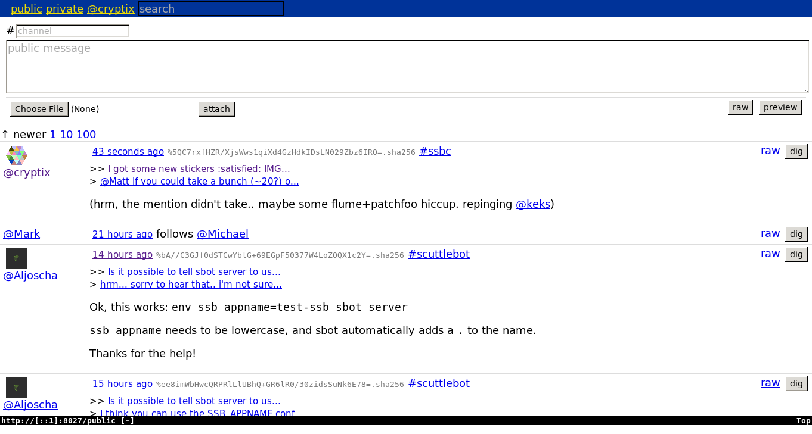

# Patchfoo & SSB

[Patchfoo](https://github.com/ssbc/patchfoo) is a simple web client for [Secure
Scuttlebutt (SSB)](https://scuttlebut.nz). It uses HTML forms instead of
client-side Javascript, making for a fast and low-power SSB experience.



# Install `sbot`

Scuttlebot (the `sbot` command) is the secure scuttlebut server program. This is
what finds, syncs, and manages the feeds of other SSB users, and lets you write
messages to the network.

Patchfoo depends on the `sbot` command being available. You can install this on
your machine via [npm](https://npmjs.org)

```
$ npm install --global scuttlebot
```

or by following the [scuttlebot installation
instructions](https://ssbc.github.io/docs/scuttlebot/install.html).

Run `sbot server` to start your SSB peer.

# Join the network

To join the SSB network, you will need a "pub server" invite code. Pub servers
don't store your data, nor do they have any authority or lock-in capabilities.

You can remove pubs, add new pubs, or just sync with other peer directly, at any
time.

Pub servers are like a "dumb pipe" that lets you find other peers in the
network, making them ideal for new users who don't know any peers yet.

You can find an invite code from a pub
[here](https://github.com/ssbc/scuttlebot/wiki/Pub-Servers), or ask in
#scuttlebutt on Freenode IRC.

# Install patchfoo

As per the [patchfoo README](https://github.com/ssbc/patchfoo):

## Standalone

```sh
git clone https://github.com/ssbc/patchfoo
cd patchfoo
npm install
npm start
```

## As an `sbot` plugin

You'll need `sbot server` running in the background.

```sh
cd ~/.ssb/node_modules
git clone https://github.com/ssbc/patchfoo
cd patchfoo
npm install
sbot plugins.enable patchfoo
# restart sbot
```

## Install extras

To most effectively render things, patchfoo needs the `ssb-backlinks` scuttlebot
plugin:

```sh
sbot plugins.install ssb-backlinks
sbot plugins.enable ssb-backlinks
# restart sbot
```

# Setting an identity

Patchfoo doesn't (yet) have a user interface for writing a profile for yourself,
such as setting your nickname, profile description, avatar, etc.

Fortunately, you can use the `sbot` command to do this, by publishing JSON
messages by hand with type `about`. To see examples of any message type on SSB,
you can run `sbot messagesByType about | less`.

You can find your own public key (your true identity) using

```
$ sbot whoami
```

Set your nick name:

```
$ sbot publish --type about --about PUBLIC_KEY --name NAME
```

Set a profile description:

```
$ sbot publish --type about --about PUBLIC_KEY --description 'hi im NAME, I like..'
```

# Open patchfoo

Direct your favourite web browser to [http://localhost:8027](http://localhost:8027).

Click on the 'public' tab. You should start to see messages as the sync process
with the pub server works.

# License

CC0

